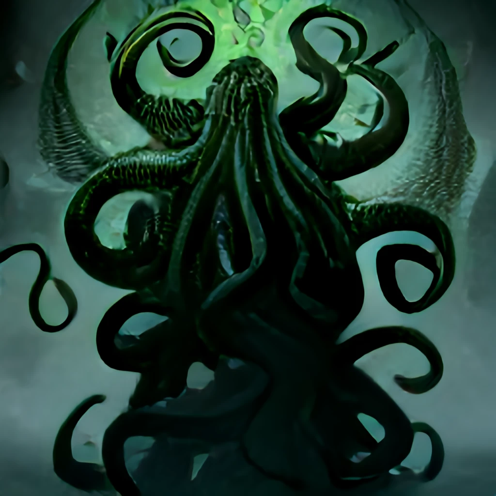

> [game](../../game.md)

# Zxen

Antiguo dios que penetra en las realidades distorsionandolas a su paso. Su llegada siempre es precedida por la de un cometa que debilita el velo. Con el ritual apropiado su esencia puede entonces hacerse patente.
Cuando Zxen es invocado las reglas de la realidad de distorsionan, el espacio y el tiempo dejan de tener sentido.

- Pasillos infinitos
- Espacios no euclideos (salir de una habitación te retorna a ella)
- Muertos vivientes
- Espejos como portales a otras realidades

Cuando las distorsiones obvias de la realidad no se manifiestan, la principal característica de Zxen es la coloración verde/azulada que toman las llamas.