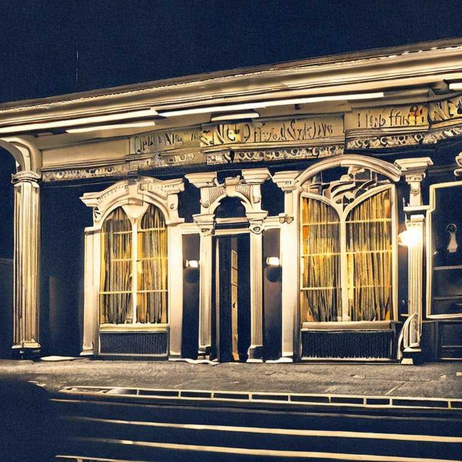

> [game](../game.md)

# Espera al carruaje



## Introducción

Bievenidos jugadores a una sesión de horror y locura. Habéis sido invitados a una encantadora velada en la casa de campo de vuestro amigo Josh, con el que perdisteis el contacto tras la muerte de su hermano.

Antes de comenzar, quiero que sepais que esta partida trata de reproducir el más puro Call of Cthulhu, y por lo tanto vuestro ultimo objetivo como jugadores no es conseguir sobrevivir, sino jugar vuestro papel en esta historia. Eso no quiere decir que debais suicidaros, la muerte es la muerte y puede provocar un fin prematuro de la partida, así que tened cuidado.

Durante la partida habrá momentos en los que como jugadores quizas sea obvio para vosotros lo que esta sucediendo. Os animo a tratar de jugar vuestros personajes como vosotros penseis que actuarian de forma honesta, sin utilizar lo que sabeis a favor de vuestro personaje si este no lo sabe.

## Resumen

[Adrian](../Chrs/PCs/Adrian.md) y [David](../Chrs/PCs/David.md) esperan fuera del club de caballeros la llegada del carruaje que les llevará a la casa de campo de [Josh](../Chrs/NPCs/Josh.md).

Cuando el llega el carruaje pueden ver que ya hay dos personas dentro [Carmen](../Chrs/NPCs/Carmen.md) y [Thurston](../Chrs/NPCs/Thurston.md).

## Notas

## Diagrama de eventos

```mermaid
  graph TD;
```

## Diálogos

Conductor:

```
Señores Adrian y David, Josh les espera en su cada de campo, les llevaré directamente allí si hacen el favor de subir
```