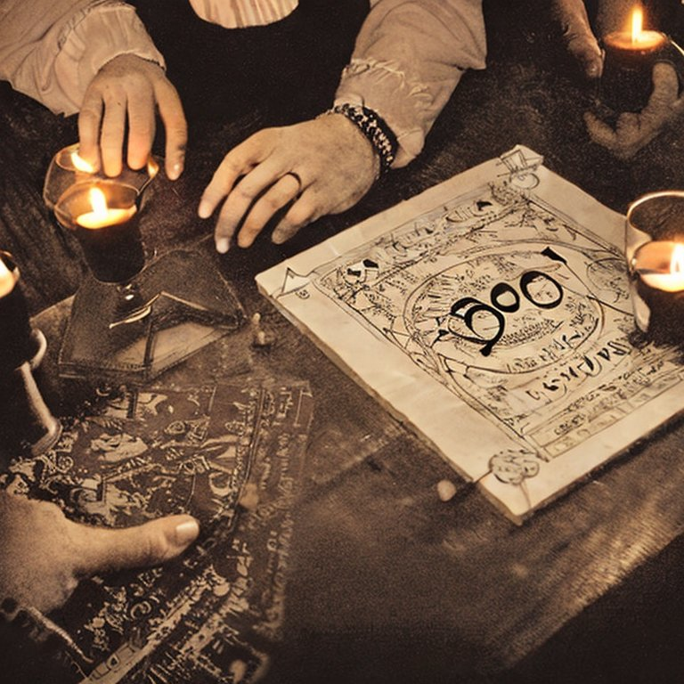
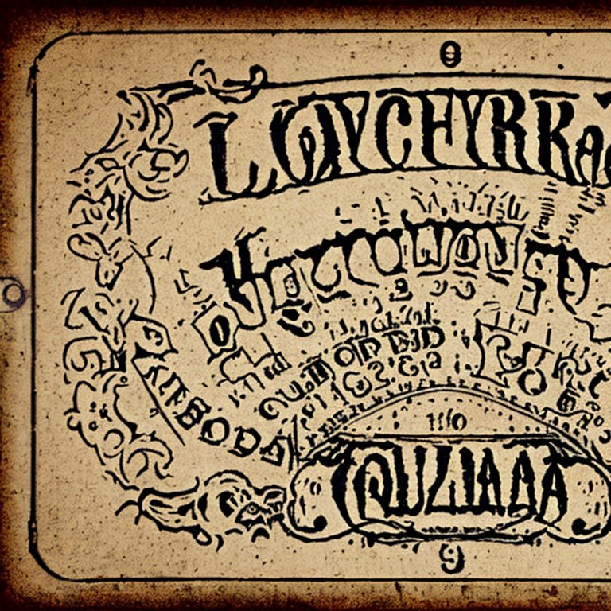
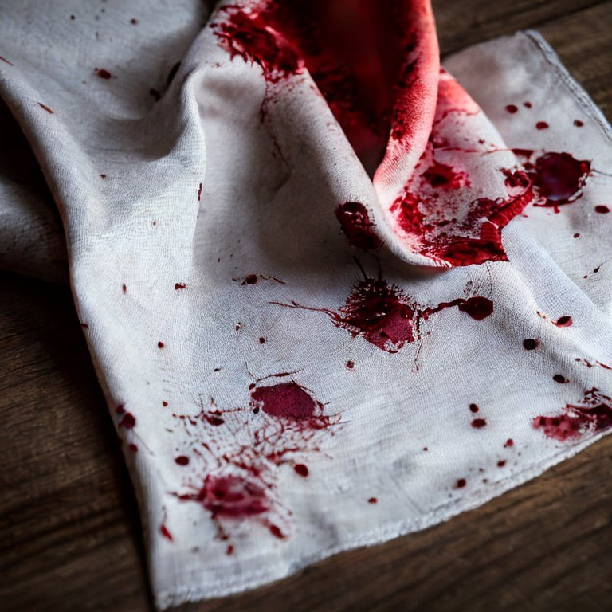
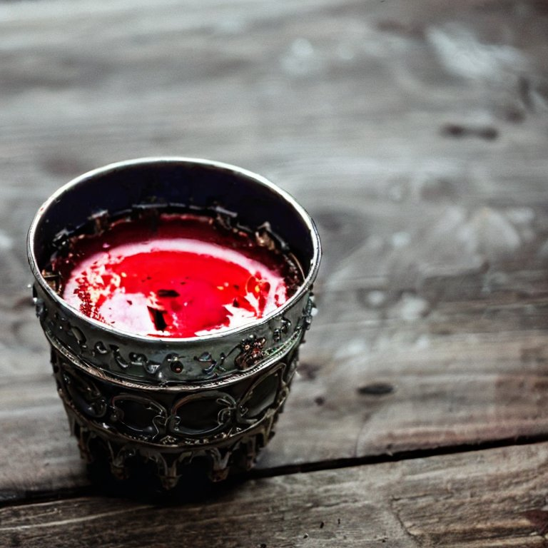

> [game](../game.md)

# Ritual

Consiste en un intento de conexión con el más allá llevado a cabo por el [medium](../Chrs/NPCs/Thurston.md) usando un instrumento, un recuerdo y una ofrenda.

## Requisitos

### Instrumento

Tablero de ouija

### Recuerdo

Pañuelo del [difunto](../Chrs/NPCs/Jorge.md) con sus iniciales y restos de sangre

### Ofrenda

Sangre de los presentes recogida en la misma copa y situada en el centro del círculo.

## Ejecución

Los presentes se situan alrededor de una mesa en la que se encuentra el instrumento, el recuerdo y la ofrenda. Todos se dan la mano creando un circulo / semicirculo que no debe ser roto.