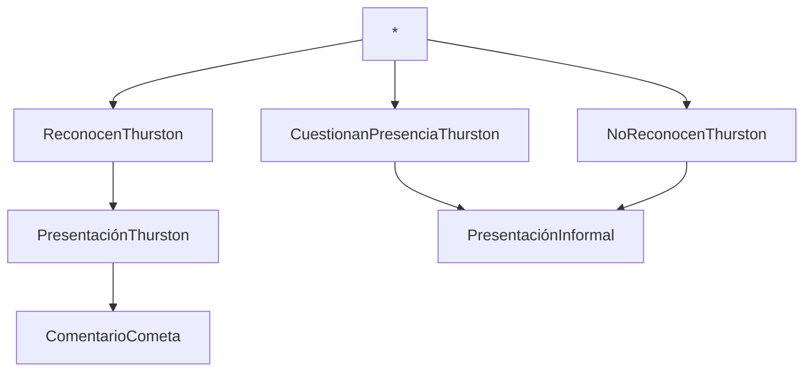

> [game](../game.md)

# Viaje a la casa de campo

Los cuatro invitados a la casa de campo de [Josh](../Chrs/NPCs/Josh.md) viajan durante algo más de dos horas en el mismo carruaje.

## Notas

- Thurston tiene como premisa no contar los motivos de su visita. Dirá que es medium si se le tira de la lengua, pero no más
- Carmen no sabe el motivo de la visita, se encuentra tan perdida como el resto
- El cochero tampoco sabe nada

## Diagrama de eventos



## Diálogos

Sí se reconoce a Thurston:

```
Sí, soy James Thurston, medium. ¿Han estado ustedes en alguno de mis espectáculos?

Hace unos cuantos años a gente con mi sensibilidad se les tildaba de locos, o incluso peor, ¡de herejes! Por suerte hoy en día puedo ayudar a la gente con mis habilidades. 
```

Sí no reconocen a Thurston o si preguntan quien es:

```
Mi nombre es James Thurston, he coincidido alguna vez con nuestro anfitrión Josh en el club y en alguna reunión privada.
``` 

El cometa:
```
Caballeros, estamos ante un espectáculo único. La llegada del cometa no solo es una maravilla de observar en el cielo nocturno, sino que para los menesteres que me ocupan, supone una oportunidad de contactar con el más allá.

Hoy caballeros, el velo es más fino que nunca.
```