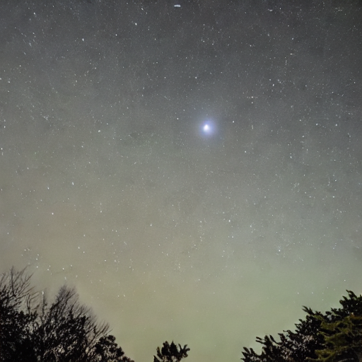
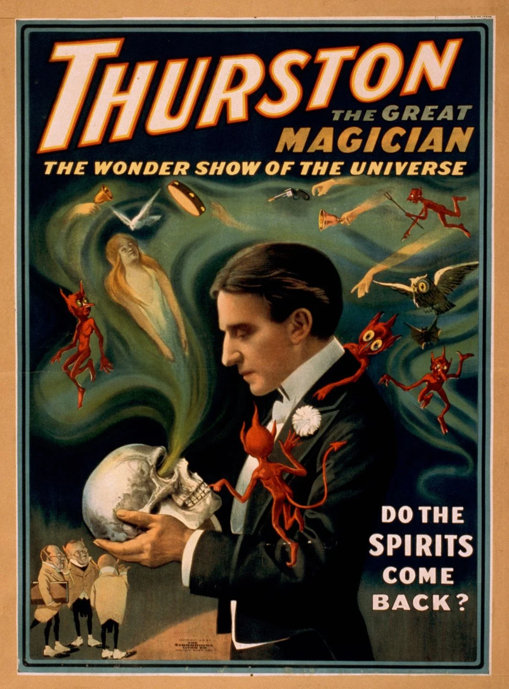

# Resumen

Dos aristócratas son invitados por un [antiguo amigo](./Chrs/NPCs/Jorge.md) a una velada en su [casa de campo](./Resources/Maps/mansion.ds) con la excusa de retomar viejas amistades y ver la llegada del cometa en el cielo nocturno. Sin embargo, una vez allí verán que las intenciones de su antiguo amigo son otras: realizar un ritual con un tablero de ouija y un [medium](./Chrs/NPCs/Thurston.md) para contactar con su hermano. El [ritual](./Events/Ritual.md), aunque a primera vista inofensivo, saldrá "mal", invocando el caos y la muerte en la aislada mansión.

# Personajes

## PCs

### Invitados 

- [David](./Chrs/PCs/David.md)
- [Adrian](./Chrs/PCs/Adrian.md)

## NPCS

### Labeaus

- [Josh I. Labeau](./Chrs/NPCs/Josh.md)
- [Jorge Labeau](./Chrs/NPCs/Jorge.md)

### Invitados

- [Carmen S](./Chrs/NPCs/Carmen.md)
- [Thurston (medium)](./Chrs/NPCs/Thurston.md)

### Personal de la casa

- [Virgilio](./Chrs/NPCs/Virgilio.md)

# Ambientación

La historia se situa a mediados del s.XIX, en una sociedad aristocrática. Emergen oportunistas como los mediums que se aprovechan de las crédulas nuevas generaciones de nobles para ganarse la vida.

En un par de semanas se dará un acontecimiento con gran expectación dentro de la comunidad aristocrática, el paso de un cometa:

No solo es de importancia en el campo astronómico, sino que astrólogos, mediums y otros creyentes lo anuncian como un acercamiento entre mundos.

Realmente la presencia del cometa junto a las prácticas adecuadas darán lugar a una ventana de oportunidad para [Zxen](./Chrs/NPCs/Zxen.md) penetre en nuestra realidad.

# Lugares

- [Mansión](./Resources/Maps/mansion.md)

# Cronología

- [Espera al carruaje](./Events/EsperaCarruaje.md)
- [Viaje a la casa de campo](./Events/ViajeEnCarruaje.md)
- [Recepción](./Events/Recepcion.md)
- [Cena](./Events/Cena.md)
- [Ritual](./Events/Ritual.md)
- Más

# Recursos

## Texto

- [Invitation](./Resources//invitation.md)

# Fuentes

## Imágenes

- Generación: https://huggingface.co/spaces/stabilityai/stable-diffusion
- Inpainting: https://huggingface.co/spaces/multimodalart/stable-diffusion-inpainting
- Cometas: https://racingnelliebly.com/weirdscience/great-comets-victorian-era/
- Mapas: https://app.dungeonscrawl.com/