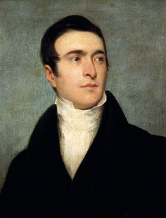

> [Game](../../game.md)

# Thurston

Es un reconocido medium en la sociedad aristócrata, famoso por sus predicciones sobre el futuro de las familias y los desposamientos. Sin embargo, es un farsante que se aprovecha de las necesidades de aquellos que buscan sus servicios para ganar respeto y dinero.

## Motivaciones

- Dispuesto a engañar y traicionar con tal de mantener su reputación
- Es cobarde y si ve que su vida corre peligro escapará dejando atrás a quien haga

## Apuntes

- Hablar grave y muy pausado
