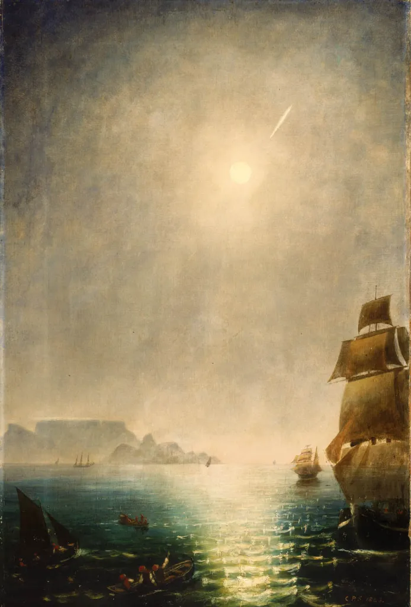
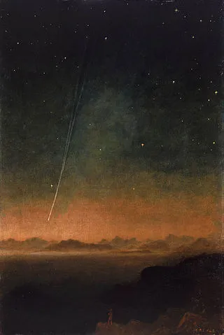

# Resumen

Dos aristócratas son invitados por un antiguo amigo a una velada en su casa de campo con la excusa de retomar viejas amistades y ver la llegada del cometa en el cielo nocturno. Sin embargo, una vez allí verán que las intenciones de su antiguo amigo son otras: realizar un ritual con un tablero de ouija y un medium para contactar con su hermano. El ritual, aunque a primera vista inofensivo, saldrá mal, invocando el caos y la muerte en la aislada mansión.

# Personajes

## PCs

- [David](./Chrs/PCs/David.md)
- [Adrian](./Chrs/PCs/Adrian.md)

## NPCS

- [Josh I. Labeau](./Chrs/NPCs/Josh.md)
- [Jorge Labeau](./Chrs/NPCs/Jorge.md)
- [Medium](./Chrs/NPCs/Medium.md)

# Ambientación

La historia se situa a mediados del s.XIX, en una sociedad aristocrática. Emergen oportunistas como los mediums que se aprovechan de las crédulas nuevas generaciones de nobles para ganarse la vida

# Lugares

## Mansión

### Planta Baja

### Prinera Planta

### Desván

### Sótano

# Recursos

## Mapas

- [Mansión](./Resources/Maps/mansion.md)

## Texto

- [Invitation](./Resources//invitation.md)

## Imágenes

### Cometa

- 
- 
